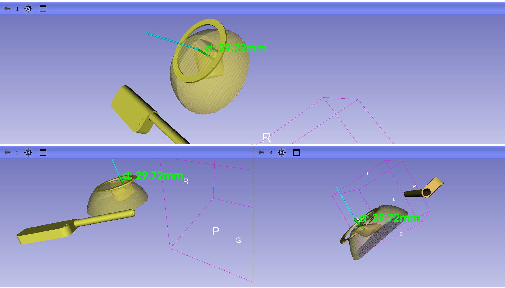

# How to use this module

## Setup
- Load Example Models or load the scene with saved registered models
- Connect tool tracking using OpenIGTLink
- Perform fiducial registration and pivot calibration if necessary

## Module
- Edit -> Application settings -> drag and drop inner US cavity reconstruction folder
- Open US cavity reconstruction module from Ultrasound tab
- Select probe tip points (ex. probeTipPoints)
- Select point cloud (ex. create new point cloud)

### Live cavity scan
- under the Accuracy test tab, start collecting when the US probe is in position, stop when finished. Make sure to keep the probe within the breast cavity when recording points. Under the advanced tab, you can add a delay before it starts collecting if needed.
- for the tumour, place the US probe over the tumor and select Place Experiment Point

### Visualization
- **Generate cavity**: Takes the point cloud, creates a convex hull and subtracts it from the breast phantom model
- **Generate tumour**: Creates a small sphere tumour model around the placed point
- **Enable Navigation**: Displays the distancew from the needle tip to the tumour model

